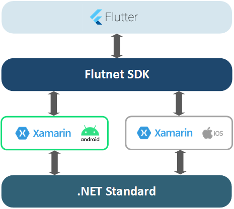
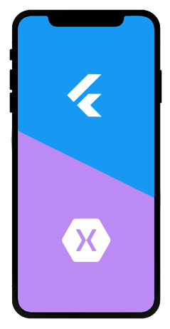

# Flutnet Runtime libraries

| Flutnet.Android                                                                                             | Flutnet.iOS                                                                                         |
| ----------------------------------------------------------------------------------------------------------- | --------------------------------------------------------------------------------------------------- |
| [](https://www.nuget.org/packages/Flutnet.Android/) | [](https://www.nuget.org/packages/Flutnet.iOS/) |

This repository holds the class libraries that allow the communication between Flutter and Xamarin inside a Xamarin.Android or Xamarin.iOS project. The main components for initializing and managing this communication layer are the [FlutnetRuntime](https://www.flutnet.com/Documentation/Reference/Flutnet-Runtime) and the [FlutnetBrigde](https://www.flutnet.com/Documentation/Reference/Flutnet-Bridge) classes. For more information on the overall architecture please read through the [Flutnet documentation](https://www.flutnet.com/Documentation/Introduction/Flutnet-Architecture).

These libraries are published on [NuGet Gallery](https://www.nuget.org/) with the names [Flutnet.Android](https://www.nuget.org/packages/Flutnet.Android/) and [Flutnet.iOS](https://www.nuget.org/packages/Flutnet.iOS/).

## What is Flutnet?

Flutnet is a set of tools and libraries that allow you to create rich and beautiful Xamarin apps using [Flutter](https://flutter.dev/) as UI Layer and .NET as backend. For more details please visit https://www.flutnet.com/.

<div style="background-color:white; padding:0%; margin-bottom: 3%;">


</div>

## Build procedure :hammer:

The following procedure refer to a **macOS system**, because we need a macOS machine in order to build both Android and iOS.

The build process is composed by:
 - [Restore all NuGet Packages](#restore-all-nuget-packages)
 - [Build the source projects](#build-the-source-projects)
 - [Create Nuget packages](#create-nuget-packages)
 - [Build the Sample](#build-the-sample)

### Restore NuGet Packages

To ensure that all required nuget packages (for the projects) will be restored run the command

```sh
scripts/restore-nuget-packages.sh
```

### Build the source projects

Run the following script in order to build the projects **Flutnet.Android** and **Flutnet.iOS** inside the `Flutnet.sln` solution.

```sh
scripts/build-src.sh
```

>Visual studio build tool know where to find the nuget packages because the information is indicated inside the `NuGet.Config` file.

### Create Nuget packages

From the projects already builded we now can create the nuget packages.

Run
```sh
scripts/pack.sh
```

All the packages will be placed inside `artifacts/nuget-packages/` folder:
- Flutnet.Android.2.0.0.nupkg
- Flutnet.iOS.2.0.0.nupkg
- Flutnet.ServiceModel.2.0.0.nupkg


### Build the Sample

The sample project is placed in `samples/` folder is a fully Flutnet sample app for both Android and iOS. The build process will build the `samples/Flutnet.Samples.sln` file.

Run
```sh
scripts/build-samples.sh
```

At the first time, the build process will require more time because needs to build the Flutter Module used inside the Xamarin app. Check the [Flutnet Architecture](https://www.flutnet.com/Documentation/Introduction/Flutnet-Architecture) for more details.

### Run the project on a device

You can alwais open the `samples/Flutnet.Samples.sln` in Visual Studio running the project on a real device. If you want to run the project for iOS ensure to setup your apple-ID in Visual Studio.

## Optional - build using custom _Flutnet.Interop.*_ libs

In case you want to use your custom **Flutnet.Interop.Android/iOS** libraries, you can build your own packages following the instruction from the [Flutnet Xamarin Bindings Libraries](https://github.com/flutnet/flutnet_xamarin-bindings) repository.

After that just edit the `samples/NuGet.Config`  file (specifying the corresponding packages PATH) and follow the [Build procedure](#build-procedure-hammer) provided in this documentß.


## Contributing

Pull requests are welcome. For major changes, please open an issue first to discuss what you would like to change.

## License

[](https://www.gnu.org/licenses/lgpl-3.0)