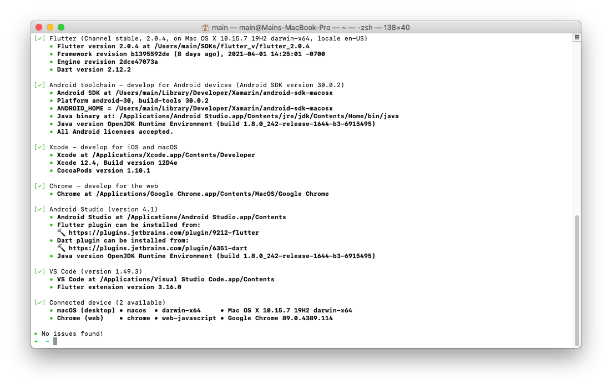

# Flutnet Runtime Libraries

[](https://www.gnu.org/licenses/lgpl-3.0)

| Flutnet.Android                                                                                             | Flutnet.iOS                                                                                         |
| ----------------------------------------------------------------------------------------------------------- | --------------------------------------------------------------------------------------------------- |
| [](https://www.nuget.org/packages/Flutnet.Android/) | [](https://www.nuget.org/packages/Flutnet.iOS/) |

This repository holds the class libraries that allow the communication between Flutter and Xamarin inside a Xamarin.Android or Xamarin.iOS project. The main components for initializing and managing this communication layer are the [FlutnetRuntime](https://www.flutnet.com/Documentation/Reference/Flutnet-Runtime) and the [FlutnetBrigde](https://www.flutnet.com/Documentation/Reference/Flutnet-Bridge) classes. For more information on the overall architecture please read through the [Flutnet documentation](https://www.flutnet.com/Documentation/Introduction/Flutnet-Architecture).

These libraries are published on [NuGet Gallery](https://www.nuget.org/) with the names [Flutnet.Android](https://www.nuget.org/packages/Flutnet.Android/) and [Flutnet.iOS](https://www.nuget.org/packages/Flutnet.iOS/).

  - [What is Flutnet?](#what-is-flutnet)
  - [System requirements](#system-requirements)
  - [Building procedure](#building-procedure)
  - [Sample app](#sample-app)
  - [Contributing](#contributing)
  - [License](#license)

## What is Flutnet?

Flutnet is a set of tools and libraries that allows you to create rich and beautiful Xamarin apps using [Flutter](https://flutter.dev/) as UI Layer and .NET as backend. For more details please visit https://www.flutnet.com/.

<div style="background-color:white; padding:0%; margin-bottom: 3%;">


</div>

## System requirements

To build and run the source projects and the sample apps, you need a **macOS** properly configured
 with:
- Xamarin (Visual Studio 2019 for Mac version 8.9.5 or later)
- Xcode with Command Line Tools (version 12.3 or later)
- Flutter SDK (version 2.0.4 or later)

For specific instructions on how to install and configure Flutter please refer to: 

- The official [Flutter installation guide](https://flutter.dev/docs/get-started/install/macos)
- The [Flutnet documentation page](https://www.flutnet.com/Documentation/Getting-Started/Install-on-macOS) (you can skip the last section _Installing Flutnet SDK_)

To check if Flutter is correctly installed run:

```sh
flutter doctor -v
```



## Building procedure

 1. [Build the source projects](#build-the-source-projects)
 2. [Create the NuGet packages](#create-the-nuget-packages)
 3. [(optionally) Build using custom _Flutnet.Interop_ packages](#optionally-build-using-custom-flutnetinterop-packages)

### Build the source projects

The following script will build all the projects within the `Flutnet.sln` solution, restoring all the required NuGet packages:

- `src/Flutnet.Android`
- `src/Flutnet.iOS`
- `src/Flutnet.ServiceModel`

```sh
scripts/build-src.sh
```

>You can always compile the .sln file in a IDE. Please make sure to build `Release` configuration before moving on to the next step.

### Create the NuGet packages

Once the Xamarin bindings have been built, run the following script to create the corresponding NuGet packages:

```sh
scripts/pack.sh
```

All the packages will be placed into `artifacts/nuget-packages/` folder.


### (optionally) Build using custom _Flutnet.Interop_ packages

The projects in this repository reference by default the _Flutnet.Interop_ packages that are published on NuGet Gallery. If you want these projects to reference your own bindings (i.e. local NuGet packages that you built on your own), please edit the `NuGet.Config` files and/or the `<PackageReference>` inside each `.csproj` (both under `src/` and `samples/` folders) accordingly.

Before building the projects, you may want to clean the NuGet cache first by running:

```sh
scripts/clear-nuget-cache.sh
```

## Sample app

### Overview

Folder `samples/` contains a full example of what you can do with Flutnet. In this folder you can find:

- A Flutter module (`flutter_module/`) defining the UI layer. In this case it's a simple view showing a counter and two buttons for incrementing and decrementing the value. 

- A Visual Studio solution (`Flutnet.Samples.sln`) containing: 
  - A Xamarin.Android app (`Flutnet.Sample.Android`)
  - A Xamarin.iOS app (`Flutnet.Sample.iOS`)
  - A further Xamarin.Android bindings library (`Flutnet.ModuleInterop.Android`) needed to embed the AAR representing the UI of the Flutter module
  - A .NET Standard class library (`Flutnet.Sample.ServiceLibrary`) containing the code shared between Android and iOS. It actually represents the business logic layer where the increment and decrement functions are implemented

- A Flutter package (`flutter_package`) containing the Dart code where all the communication logic with the native side (Xamarin) is implemented.

This project structure may look complex at a first glance. However, most of the work is done by Flutnet SDK behind the curtains. Please consult the official documentation to better understand [Flutnet and its architecture](https://www.flutnet.com/Documentation/Introduction/Flutnet-Architecture).

### Preliminary steps

To ensure we're using the latest NuGet Packages, we can clean the NuGet cache first by running:

```sh
scripts/clear-nuget-cache.sh
```

Now we can run:

```sh
scripts/build-samples.sh
```

This script will perform the following tasks:
- Build the Flutter module
- Restore all the required NuGet packages for the sample solution
- Build all the projects within the solution

### Run the sample

Once the script has completed, you can open the `samples/Flutnet.Samples.sln` solution in your IDE and start debugging both the Xamarin.Android and the Xamarin.iOS app in a simulator or on a real device.

>The sample projects reference by default the _Flutnet_ packages that are published on NuGet Gallery. If you want these projects to reference your own runtime libraries (i.e. local NuGet packages that you built on your own), please edit the `samples/NuGet.Config` file and/or the `<PackageReference>` inside each `.csproj` accordingly.

## Contributing

Pull requests are welcome. For major changes, please open an issue first to discuss what you would like to change.

## License

This project is licensed under the LPGL v3 license (https://www.gnu.org/licenses/lgpl-3.0.html)