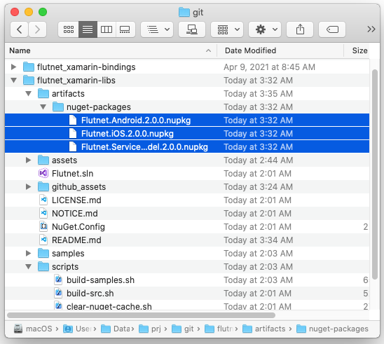

# [Flutnet](https://www.flutnet.com) runtime libraries


This repository provides all the code to build your own nuget packages [Flutnet.iOS](https://www.nuget.org/packages/Flutnet.iOS/) and [Flutnet.Android](https://www.nuget.org/packages/Flutnet.Android/). 

This packages contains both the [FlutnetRuntime](https://www.flutnet.com/Documentation/Reference/Flutnet-Runtime) and the [FlutnetBrigde](https://www.flutnet.com/Documentation/Reference/Flutnet-Bridge) used to provide the communication between Flutter and Xamarin in your Xamarin Project (see the [Flutnet Architecture](https://www.flutnet.com/Documentation/Introduction/Flutnet-Architecture)).

## What is Flutnet?

Flutnet is a set of tools and libraries that will make super easy embed Flutter (graphical framework) inside a Xamarin application (as a backend layer) to obtain a powerful and native cross platform application. For more detailts see https://www.flutnet.com/.

## Build requirements

In order to build these packages you need to have already builded the [Flutnet Xamarin Bindings Libraries](https://github.com/flutnet/flutnet_xamarin-bindings).

After that ensure to have cloned 

- `flutnet_xamarin-bindings` 
- `flutnet_xamarin-libs` 

projects in the same parent directory like the image below.


## Build procedure :hammer:

The following procedure refer to a **macOS system**, because we need a macOS machine in order to build both Android and iOS.

The build process is composed by:
 - [Restore all NuGet Packages](#restore-all-nuget-packages)
 - [Build the source projects](#build-the-source-projects)
 - [Create Nuget packages](#create-nuget-packages)
 - [Build the Sample](#build-the-sample)

### Restore NuGet Packages

To ensure that all required nuget packages (for the projects) will be restored run the command

```sh
scripts/restore-nuget-packages.sh
```

### Build the source projects

Run the following script in order to build the projects **Flutnet.Android** and **Flutnet.iOS** inside the `Flutnet.sln` solution.

```sh
scripts/build-src.sh
```

>Visual studio build tool know where to find the nuget packages because the information is indicated inside the `NuGet.Config` file.

### Create Nuget packages

From the projects already builded we now can create the nuget packages.

Run
```sh
scripts/pack.sh
```

All the packages will be placed inside `artifacts/nuget-packages/` folder:
- Flutnet.Android.2.0.0.nupkg
- Flutnet.iOS.2.0.0.nupkg
- Flutnet.ServiceModel.2.0.0.nupkg



### Build the Sample

The sample project is placed in `samples/` folder is a fully Flutnet sample app for both Android and iOS. The build process will build the `samples/Flutnet.Samples.sln` file.

Run
```sh
scripts/build-samples.sh
```

At the first time, the build process will require more time because needs to build the Flutter Module used inside the Xamarin app. Check the [Flutnet Architecture](https://www.flutnet.com/Documentation/Introduction/Flutnet-Architecture) for more details.

>NOTE: Visual studio know where to find the nuget packages because the information is indicated inside the `samples/NuGet.Config` file.

### Run the project on a device

You can alwais open the `samples/Flutnet.Samples.sln` in Visual Studio running the project on a real device. If you want to run the project for iOS ensure to setup your apple-ID in Visual Studio.